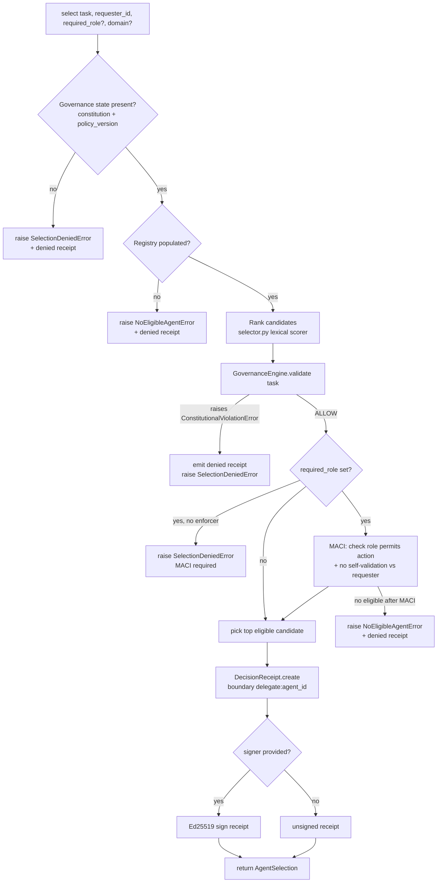

# feat: Governed Agent Capability Registry + Task→Agent Selector

## Summary

Add a two-layer agent-discovery capability so an orchestrating agent can always
find and pick the most suitable agent for a task, with every selection governed
by the constitution.

- **Layer 1 (library):** a new `src/acgs_lite/agents/` subpackage — an
  `AgentCapabilityProfile` schema, an `AgentRegistry` (mirroring the existing
  `provider_capabilities.CapabilityRegistry` pattern), and a
  `GovernedAgentSelector` that ranks candidates and routes the chosen action
  through the constitution and MACI before returning a selection bound to a
  signed-capable `DecisionReceipt`.
- **Layer 2 (repo scaffolding):** a machine-readable `.claude/agent-index.json`
  describing this repo's own coding agents/skills using the *same* profile
  schema, plus an `AGENTS.md` "Agent Discovery" section. A schema-conformance
  test loads the index through `AgentRegistry` so the two layers cannot drift.

Governance invariants held throughout: selection is **fail-closed** (no
constitution/policy state, empty registry, or no eligible candidate → raise, never
a silent pick), every selection **produces a `DecisionReceipt`**, and the selector
**never bypasses MACI** (role checks + no self-validation run before a selection is
authorized).

---

## Problem Frame

acgs-lite governs *whether a proposed action may execute*, but offers no governed
way to answer the upstream question: **"which agent should take this task?"** An
orchestrator today has to pick an agent out-of-band, then govern the action — so
the *selection* itself is ungoverned, unaudited, and unprovable. There is also no
machine-readable inventory of this repo's own coding agents/skills, so a coding
agent working in acgs-lite cannot reliably route a task to the right specialist
(e.g. `governance-branch-review` vs a general reviewer).

The crux: selection must be **discoverable** (a registry an agent can query) and
**legitimate** (fail-closed, receipted, MACI-respecting) — reusing the existing
Runtime Legitimacy Kernel rather than inventing a parallel decision path.

---

## Requirements

- **R1** — A registry of agent capability profiles supporting register, lookup,
  active-only listing, and deterministic ranked candidate resolution for a task.
- **R2** — A selector that returns the most suitable agent for a task **only**
  after a governed, fail-closed decision, and attaches a `DecisionReceipt` to
  every outcome (allow and deny).
- **R3** — Selection never bypasses MACI: the chosen agent's role must permit the
  action, and a requester can never be selected as its own validator.
- **R4** — Optional Ed25519 signing of the selection receipt when the `crypto`
  extra is present; unsigned path must work with no extra installed.
- **R5** — New public API exported from the top-level package with a stability
  tier, no import-time heavy/optional SDK loads.
- **R6** — `docs/api/agents.md` documents the surface in the existing docs/api
  format.
- **R7** — A machine-readable `.claude/agent-index.json` of this repo's coding
  agents/skills, conformant to the `AgentCapabilityProfile` schema, plus an
  `AGENTS.md` "Agent Discovery" section explaining how agents route tasks.
- **R8** — A test loads `.claude/agent-index.json` through the registry and
  asserts every entry is a valid profile (drift guard tying Layer 2 to Layer 1).
- **R9** — Full verification sequence (`make lint && make typecheck && make test
  && make build`) passes; `matcher.py` hot-path is untouched.

---

## Key Technical Decisions

- **KTD1 — Name the ranking module `selector.py`, never `matcher.py`.** The
  governance hot-path `src/acgs_lite/engine/matcher.py` is protected by CLAUDE.md
  ("Never change matcher.py hot-path behavior without targeted tests"). A new file
  named `matcher.py`, even at a different path, invites conflation by reviewers and
  agents. Ranking lives in `src/acgs_lite/agents/selector.py` and does not import
  or alter the governance matcher.
- **KTD2 — Mirror `provider_capabilities.CapabilityRegistry`.** The existing
  registry (singleton via `get_capability_registry()`, JSON manifest auto-load,
  thread-safe reads, `reset_*` for tests) is the established pattern. `AgentRegistry`
  + `get_agent_registry()` + `reset_agent_registry()` follow it 1:1 for
  consistency and reviewer familiarity.
- **KTD3 — Reuse the Legitimacy Kernel, do not fork a decision path.** Selection
  emits a `legitimacy.receipt.DecisionReceipt` via `DecisionReceipt.create(...)`,
  uses the canonical `DecisionState` taxonomy, and binds the chosen agent through
  `ExecutionBoundary(allowed_method="delegate:<agent_id>", allowed_subjects=(agent_id,),
  allowed_scope=domain)`. This makes selections replay-verifiable with the existing
  `replay_and_verify` machinery (R4) for free.
- **KTD4 — Deterministic pure-Python lexical ranker as the default.** Candidate
  scoring is keyword/capability/domain overlap between the task terms and each
  profile — deterministic and dependency-free, honoring the "keep Python fallbacks"
  rule. A semantic/embedding ranker is explicitly **deferred** (see Scope
  Boundaries), keeping this change free of new heavy deps.
- **KTD5 — Fail-closed is an exception, not a sentinel.** Missing governance state,
  an empty registry, a constitutional violation, or zero eligible candidates each
  raise a typed error that **carries the denied `DecisionReceipt`** for audit —
  never a `None` return or a silent best-effort pick. `SelectionDeniedError`
  subclasses `ConstitutionalViolationError` to match CK-002 ("validation failures
  raise").
- **KTD6 — MACI is mandatory when a role is required.** If `required_role` is
  supplied but no `MACIEnforcer` is provided, the selector fails closed (raises)
  rather than skipping the check — "never bypass MACI enforcement" applies to the
  selection path.
- **KTD7 — One schema, two layers.** `.claude/agent-index.json` uses the exact
  `AgentCapabilityProfile` JSON shape the library registry loads, and U6's test
  loads it through `AgentRegistry.from_manifest()`. The repo index is *the*
  worked example of the library schema; drift breaks a test.
- **KTD8 — Beta stability tier.** New surface registers as `beta` in the
  `__init__.py` stability metadata — a coherent, tested API, but young enough that
  the ranker contract may evolve.

---

## High-Level Technical Design

Selection flow — a governed gate sequence, each step fail-closed:



Decision states used: `ALLOW` for an authorized selection; denials map to
`HARD_DENY` / `DENY_OPERATION_WITH_ALTERNATIVE` via `canonicalize_decision_state`
on the carried receipt. Only `ALLOW` returns a usable `selected_agent_id`.

---

## Output Structure

```text
src/acgs_lite/agents/
├── __init__.py                       # subpackage exports
├── capability.py                     # AgentCapabilityProfile (frozen) + (from|to)_dict
├── registry.py                       # AgentRegistry, get_agent_registry, reset_agent_registry
├── selector.py                       # GovernedAgentSelector, AgentSelection, lexical ranker
├── errors.py                         # SelectionDeniedError, NoEligibleAgentError
└── agent_capabilities_manifest.json  # bundled default manifest (may be [] )

.claude/agent-index.json              # repo's coding agents/skills (Layer 2)
docs/api/agents.md                    # API docs page
tests/test_agent_registry.py
tests/test_governed_selector.py
tests/test_agent_index.py
```

The per-unit **Files** lists below are authoritative; the implementer may adjust
layout if a better split emerges.

---

## Implementation Units

### U1. Agent capability profile + schema

**Goal:** A frozen, validated `AgentCapabilityProfile` value type and the JSON
shape both layers share.

**Requirements:** R1, R7 (schema), R8 (schema)

**Dependencies:** none

**Files:**
- `src/acgs_lite/agents/__init__.py` (create)
- `src/acgs_lite/agents/capability.py` (create)
- `tests/test_agent_registry.py` (create — profile cases; registry cases land in U2)

**Approach:** `@dataclass(slots=True, frozen=True) AgentCapabilityProfile` with
fields: `agent_id: str`, `name: str`, `description: str = ""`,
`capabilities: tuple[str, ...] = ()`, `domains: tuple[str, ...] = ()`,
`skills: tuple[str, ...] = ()`, `tags: tuple[str, ...] = ()`,
`support_level: str = "community"`, `stability: str = "beta"`,
`is_active: bool = True`, `metadata: Mapping[str, Any] = field(default_factory=dict)`.
Provide `from_dict(data) -> AgentCapabilityProfile` (coerces lists→tuples, rejects
empty `agent_id`/`name`) and `to_dict() -> dict`. No external deps; pure stdlib.

**Patterns to follow:** `ProviderCapabilityProfile` in
`src/acgs_lite/provider_capabilities.py` (field shape, `from_dict`/`to_dict`,
frozen dataclass).

**Test scenarios (tests/test_agent_registry.py):**
- Happy: construct a profile; `to_dict`→`from_dict` round-trips identically.
- Edge: `from_dict` with list values coerces to tuples; missing optional fields
  use defaults.
- Error: `from_dict` with empty/whitespace `agent_id` or `name` raises `ValueError`.
- Edge: `is_active=False` profile round-trips and is flagged inactive.

**Verification:** Profile imports from `acgs_lite.agents`, round-trips, and rejects
invalid input.

---

### U2. AgentRegistry + manifest loading + singleton

**Goal:** Registry with register/lookup/list and deterministic ranked candidate
resolution, mirroring the provider capability registry.

**Requirements:** R1

**Dependencies:** U1

**Files:**
- `src/acgs_lite/agents/registry.py` (create)
- `src/acgs_lite/agents/agent_capabilities_manifest.json` (create — bundled default,
  may be empty array)
- `tests/test_agent_registry.py` (extend)

**Approach:** `AgentRegistry` with `register(profile)`,
`get(agent_id) -> AgentCapabilityProfile | None`,
`list_profiles(active_only=True) -> list`, `clear()`, `reset()`,
`from_manifest(path) -> AgentRegistry` (classmethod loading the JSON array via
`AgentCapabilityProfile.from_dict`), and
`candidates_for(task, *, domain=None, active_only=True) -> list[tuple[profile, score]]`
returning profiles ranked by the lexical scorer (descending score, ties broken by
`agent_id` for determinism). Module-level `get_agent_registry()` singleton that
lazily auto-loads the bundled manifest if present (tolerant of absence / empty
array), and `reset_agent_registry()` for tests. Thread-safe reads via the same
locking shape as `provider_capabilities`.

**Patterns to follow:** `CapabilityRegistry`, `get_capability_registry()`,
`reset_capability_registry()` in `src/acgs_lite/provider_capabilities.py`; manifest
load mirrors `provider_capabilities_manifest.json` handling.

**Test scenarios:**
- Happy: register N profiles, `get` returns the right one, `list_profiles` returns
  active ones.
- Edge: `active_only=True` excludes inactive profiles; `active_only=False` includes
  them.
- Happy: `candidates_for` returns profiles ordered by descending score; the
  best-overlapping profile ranks first.
- Edge: ranking is deterministic across runs and stable for equal scores (sorted by
  `agent_id`).
- Edge: empty registry → `candidates_for` returns `[]` (no raise here; fail-closed
  lives in U3).
- Integration: `from_manifest` loads a temp JSON file into valid profiles;
  malformed entry raises with a clear message.
- Singleton: `get_agent_registry()` returns the same instance;
  `reset_agent_registry()` clears it; absent/empty bundled manifest does not error.

**Verification:** Registry registers, lists, ranks deterministically, and loads a
manifest; singleton + reset behave like the provider registry.

---

### U3. Governed selector — fail-closed, receipts, MACI

**Goal:** The governed `select()` entry point that returns a suitable agent only
after a fail-closed, receipted, MACI-respecting decision.

**Requirements:** R2, R3, R4, R9 (no matcher.py change)

**Dependencies:** U1, U2

**Files:**
- `src/acgs_lite/agents/selector.py` (create)
- `src/acgs_lite/agents/errors.py` (create)
- `tests/test_governed_selector.py` (create)

**Approach:**
- `errors.py`: `SelectionDeniedError(ConstitutionalViolationError)` and
  `NoEligibleAgentError(GovernanceError)`, each carrying an optional
  `receipt: DecisionReceipt` attribute for audit.
- `@dataclass(slots=True, frozen=True) AgentSelection`: `selected_agent_id: str`,
  `decision: DecisionState`, `receipt: DecisionReceipt`,
  `signed_receipt: SignedReceipt | None`,
  `candidates: tuple[tuple[str, float], ...]` (agent_id, score), `rationale: str`.
- `GovernedAgentSelector.__init__(self, *, registry, engine, maci_enforcer=None,
  signer=None, policy_version=None)`. `engine` is a `GovernanceEngine`;
  `policy_version` defaults to the engine's constitution version/hash.
- `select(self, task, *, requester_id="anonymous", required_role=None, domain=None,
  candidates=None) -> AgentSelection`:
  1. **Fail-closed guards:** no constitution/`policy_version` → emit denied receipt,
     raise `SelectionDeniedError`. Registry empty (and no explicit `candidates`) →
     raise `NoEligibleAgentError` with denied receipt.
  2. Rank via `registry.candidates_for(task, domain=domain)` (or score the supplied
     `candidates`).
  3. `engine.validate(task, agent_id=requester_id, context={"domain": domain})`.
     `ConstitutionalViolationError` → build denied receipt (`HARD_DENY`), raise
     `SelectionDeniedError` from it (fail-closed).
  4. **MACI:** if `required_role` set and `maci_enforcer is None` → raise
     `SelectionDeniedError` (KTD6). Otherwise, walking candidates best-first, for
     each candidate call `maci_enforcer.check(agent_id, task)` and, when selecting a
     validator, `maci_enforcer.check_no_self_validation(requester_id, agent_id)`;
     skip candidates that fail. No eligible candidate survives → raise
     `NoEligibleAgentError` with denied receipt.
  5. Build the authorized `DecisionReceipt.create(... decision_type="ALLOW",
     goal=task, proposed_method=f"delegate:{agent_id}", policy_version=...,
     authority_basis=..., matched_constraints=(), execution_boundary=ExecutionBoundary(
     allowed_method=f"delegate:{agent_id}", allowed_scope=domain,
     allowed_subjects=(agent_id,), expires_at=None, single_use=False))`.
  6. If `signer` provided → `signer.sign_receipt(receipt)` → `signed_receipt`.
  7. Return `AgentSelection`.
- **No import of or change to `engine/matcher.py`.** Ranking is independent.

**Patterns to follow:** `DecisionReceipt.create` / `ExecutionBoundary` in
`src/acgs_lite/legitimacy/receipt.py`; `Ed25519ReceiptSigner.sign_receipt` in
`legitimacy/signing.py`; `MACIEnforcer.check` / `check_no_self_validation` in
`maci/enforcer.py`; raise-on-violation per CK-002.

**Test scenarios (tests/test_governed_selector.py, InMemory* stubs):**
- Covers R2. Happy: populated registry + permissive constitution → `select` returns
  `AgentSelection` with `decision == "ALLOW"`, a `selected_agent_id` among the
  candidates, and `receipt.verify_hash()` true.
- Covers R2. Edge: `execution_boundary.allowed_subjects == (selected_agent_id,)`
  and `allowed_method == f"delegate:{selected_agent_id}"`.
- Covers R2. Error: a task that violates a CRITICAL rule → `SelectionDeniedError`,
  and the raised error carries a denied receipt (decision not `ALLOW`).
- Covers R2. Error (fail-closed): empty registry → `NoEligibleAgentError`, no silent
  pick; selector with no constitution/policy_version → `SelectionDeniedError`.
- Covers R3. Error: requester cannot be selected as its own validator
  (`check_no_self_validation` enforced) — that candidate is skipped.
- Covers R3. Error: `required_role` set with `maci_enforcer=None` →
  `SelectionDeniedError` (MACI not bypassed).
- Covers R3. Edge: candidate whose MACI role forbids the action is skipped; if none
  remain → `NoEligibleAgentError`.
- Covers R4. Integration: with an `Ed25519ReceiptSigner`, `signed_receipt` is set
  and `replay_and_verify(signed, evaluator, expected_public_key=...)` reports `ok`
  (reuse `legitimacy.replay_verify`).
- Covers R4. Edge: with no signer, `signed_receipt is None` and the unsigned path
  needs no `crypto` extra.

**Verification:** ALLOW returns a receipted selection; every denial path raises a
typed error carrying a receipt; MACI checks always run; signed path replay-verifies.

---

### U4. Public API exports + stability

**Goal:** Expose the surface from the top-level package without import-time heavy
deps.

**Requirements:** R5

**Dependencies:** U1, U2, U3

**Files:**
- `src/acgs_lite/__init__.py` (modify — add to `__all__`, stability metadata)
- `tests/test_agent_registry.py` (extend — top-level import + stability assertions)

**Approach:** Add `AgentCapabilityProfile`, `AgentRegistry`, `get_agent_registry`,
`reset_agent_registry`, `GovernedAgentSelector`, `AgentSelection`,
`SelectionDeniedError`, `NoEligibleAgentError` to `__all__`. Register each in the
`beta` stability tier (KTD8). The `agents` subpackage imports only stdlib +
`acgs_lite.legitimacy` + `acgs_lite.maci` at module level; the optional Ed25519
signer stays lazy (already gated behind the `crypto` extra in `legitimacy.signing`).
Do **not** add `agents` imports to any import-time-eager path that would pull crypto.

**Patterns to follow:** `__all__`, `_STABILITY_*` / `API_STABILITY`, and lazy
`__getattr__` conventions already in `src/acgs_lite/__init__.py`.

**Test scenarios:**
- Happy: `from acgs_lite import GovernedAgentSelector, AgentRegistry, ...` succeeds.
- Happy: `stability("GovernedAgentSelector") == "beta"` (and peers).
- Edge: importing the package and the unsigned selection path works with the
  `crypto` extra absent (no `cryptography` import at module load).

**Verification:** All new names import from the top level, carry the `beta` tier,
and importing the package does not require optional extras.

---

### U5. API documentation page

**Goal:** Document the agent-discovery surface in the existing docs/api format.

**Requirements:** R6

**Dependencies:** U1, U2, U3, U4

**Files:**
- `docs/api/agents.md` (create)
- `mkdocs.yml` (modify — add nav entry if a nav list exists)

**Approach:** Mirror `docs/api/legitimacy.md` / `docs/api/maci.md`: H1 + stability
note; mkdocstrings blocks (`::: acgs_lite.agents.registry.AgentRegistry`,
`::: acgs_lite.agents.selector.GovernedAgentSelector`,
`::: acgs_lite.agents.capability.AgentCapabilityProfile`); a Decision &
Fail-Closed Behavior section (the gate sequence, which states deny); a Receipt
Binding table (goal/proposed_method/execution_boundary); a MACI Constraints note;
and a short end-to-end example (register profiles → construct selector → `select`).
Add to `mkdocs.yml` nav under the API section if present.

**Patterns to follow:** `docs/api/legitimacy.md`, `docs/api/maci.md`.

**Test expectation:** none — documentation. Verified via `make build` / docs build
not breaking and mkdocstrings resolving the referenced symbols.

**Verification:** Page renders, mkdocstrings resolves all referenced symbols, nav
shows the page.

---

### U6. Repo scaffolding — AGENTS.md Agent Discovery + machine-readable index

**Goal:** A machine-readable inventory of this repo's coding agents/skills plus the
AGENTS.md guidance that lets an agent route a task — schema-locked to Layer 1.

**Requirements:** R7, R8

**Dependencies:** U1, U2 (schema + loader must exist)

**Files:**
- `.claude/agent-index.json` (create — real entries for this repo's agents/skills)
- `AGENTS.md` (modify — add "Agent Discovery" section)
- `tests/test_agent_index.py` (create — drift guard)

**Approach:** Author `.claude/agent-index.json` as a JSON array of
`AgentCapabilityProfile` dicts for the repo's actual coding agents/skills —
e.g. `governance-branch-review`, `verify-governance-fixes`, and the relevant `ce-*`
review/plan personas — each with real `capabilities`, `domains`, `skills`, and a
one-line `description`. Add an "Agent Discovery" section to root `AGENTS.md`:
(a) point to `.claude/agent-index.json` and state it is the canonical routing index;
(b) show the one-liner to load it via `AgentRegistry.from_manifest(".claude/agent-index.json")`
and `candidates_for(task)`; (c) state the agent-native rule that any new agent/skill
must be added to the index; (d) link to `docs/api/agents.md`. Search first
(`find . -name AGENTS.md`) — confirmed only `./AGENTS.md` and `./hackathon/AGENTS.md`
exist; edit the root file, do not create a new one.

**Patterns to follow:** existing `AGENTS.md` section style (tables, code blocks,
absolute-internal links); `provider_capabilities_manifest.json` as the JSON-array
manifest shape.

**Test scenarios (tests/test_agent_index.py):**
- Covers R8. Happy: `AgentRegistry.from_manifest(".claude/agent-index.json")` loads
  without error and yields ≥1 profile.
- Covers R8. Edge: every loaded entry has a non-empty `agent_id` and `name`, and
  unique `agent_id`s (no duplicates in the index).
- Edge: `candidates_for("review a branch for governance regressions")` ranks the
  governance-review agent first (sanity that the index is useful, not just valid).

**Verification:** The index parses through the library loader, every entry is a valid
unique profile, AGENTS.md documents discovery, and a representative task resolves to
the expected specialist.

---

## Scope Boundaries

**In scope:** the `agents/` subpackage (profile, registry, governed selector),
top-level exports, API docs, and the repo agent-index + AGENTS.md section, all under
fail-closed/receipted/MACI governance.

### Deferred to Follow-Up Work
- **Semantic / embedding ranker** behind an optional extra (default stays the
  deterministic lexical scorer — KTD4).
- **Auto-syncing `.claude/agent-index.json` from `.claude/` skill definitions**
  (the index is hand-authored this pass; a generator is a separate change).
- **A `select_and_execute` convenience** that chains selection → governed execution
  via `validate_receipt_for_execution`; this plan stops at returning a receipted
  selection.
- **CLI surface** (`acgs agents ...`) for querying the registry from the terminal.

### Non-goals
- No change to `engine/matcher.py` hot-path behavior (KTD1, R9).
- Not an agent runtime/executor — selection returns a decision + receipt, it does
  not run the agent.
- No new heavy runtime dependency; signing reuses the existing `crypto` extra only.

---

## Risks & Dependencies

- **Naming collision risk (medium):** a `matcher`-named file would be conflated with
  the protected hot-path. Mitigated by KTD1 (`selector.py`) and a code-review note.
- **Fail-closed correctness (high):** the value of the feature is that it never
  silently picks. Every denial branch is covered by a U3 test asserting a raise +
  carried receipt, not a `None`.
- **MACI bypass (high):** `required_role` without an enforcer must not skip the
  check. Covered by an explicit U3 test (KTD6).
- **Stability metadata drift:** `__init__.py` stability dicts must include the new
  names or `stability()` raises; covered by U4 tests.
- **Reuses:** `legitimacy.receipt`, `legitimacy.signing`, `legitimacy.replay_verify`,
  `maci.enforcer`, `engine.GovernanceEngine`, `provider_capabilities` (as pattern).

---

## Verification Strategy

Per-unit tests above, then the full gate (R9):

```text
make lint && make typecheck && make test && make build
```

Plus targeted runs during development:
`python -m pytest tests/test_agent_registry.py tests/test_governed_selector.py tests/test_agent_index.py -v --import-mode=importlib`.
Confirm `git diff --stat src/acgs_lite/engine/matcher.py` is empty.

---

## Sources & Research

- Pattern source: `src/acgs_lite/provider_capabilities.py` (+ `_manifest.json`).
- Governance primitives: `src/acgs_lite/legitimacy/{receipt,signing,replay_verify,invariants,decide}.py`.
- MACI: `src/acgs_lite/maci/enforcer.py`.
- Engine + errors: `src/acgs_lite/engine/core.py`, `src/acgs_lite/errors.py`.
- Conventions: `AGENTS.md`, `CLAUDE.md` (CK-001/002/003), `docs/api/{legitimacy,maci,engine}.md`, `Makefile`.
